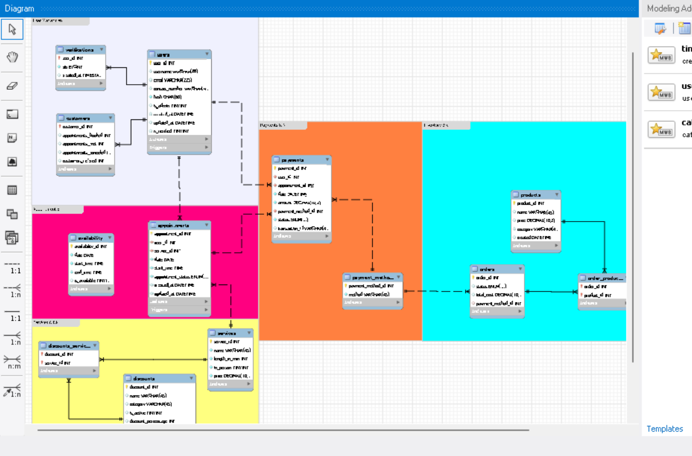
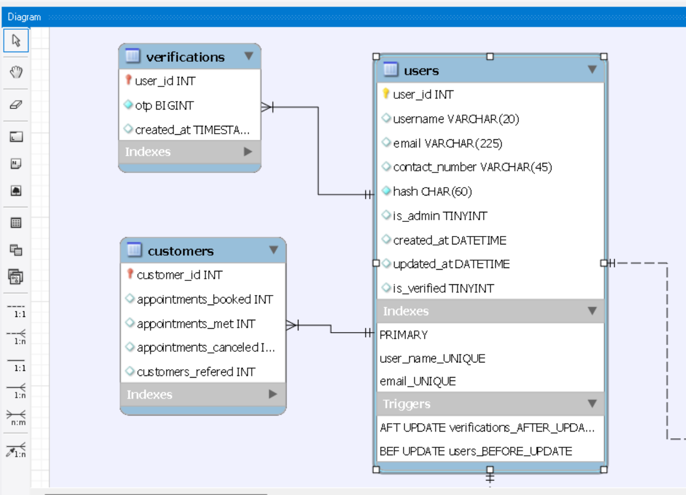

# Hair By Yehudit

This project is the backend for managing appointments for a hair salon. Given time constraints, I have currently created a MVP. This project allows a client manage customers availability and appointments and it allows customers to sign up, verify themselves and make and view appointments. The current API allows for easy extension and integration with a more developed final product.

The backend is built using express package for Node.js and MySQL DB for data management.

## Features

- **Customer Registration and Verification**: Customers can use a unique email or username together with contact number to sign up and will be able to verify their account using details they provided; either an email, OTP by either SMS or voice message. 
- **User Authentication**: Secure login and session management for users. Certain routes protected for use by users with administrative rights.
- **Appointment Booking**: Clients can check availability of service provider for a specific appointment slot and book the slot if it is available.
- **Managing Availability**: Service providers can set and update slots when they are not available.

## Tech Stack

In this project I have made it my business to demonstrate prowess in a wide variety of technologies and backend development practices as possible. 

- **Backend Framework**: Express.js
- **Database**: MySQL
- **Authentication**: JWT (JSON Web Tokens)
- **SMS and Voice Notifications**: Twilio
- **Email Notifications**: Nodemailer
- **Environment Variables**: dotenv

## Data Management
Whilst my MVP only requires basic appointment and user management, at the onset of the project I used MySQL Workbench’s powerful Enhanced Entity-Relationship Diagram (EER) tool to design and initialize a detailed database schema—laying the groundwork for a more advanced, feature-rich product that includes complex discounting and accounting functionality.

### Tables

- **appointments**
  - `appointment_id` (primary key)
  - `user_id` (foreign key referencing user table)
  - `service_id` (foreign key referencing service table)
  - `date`
  - `start_time`
  - `appointment_status`
  - `created_at`
  - `updated_at` (enables scheduled cleanup after completion or cancellation)
- **availability**
  - `availability_id` (primary key)
  - `date`
  - `start_time`
  - `end_time`
  - `is_available`
- **customers** - stores data about customers for potential rewards programs
  - `customer_id` (primary key)
  - `appointments_booked`
  - `appointments_met`
  - `appointments_canceled`
  - `customers_referred`
- **discounts** - stores details about discounts to be applied to service costs 
  - `discount_id` (primary key)
  - `name`
  - `category`
  - `is_active`
  - `discount_percentage`
  - `maximum_discount` - to limit maximum amount of money saved by specific discount
  - `valid_from`
  - `valid_until`
  - `created_at`
  - `updated_at`
- **discounts_services** - join table that links discounts to services, enabling a many-to-many relationship. 
  - `discount_id` (foreign key referencing discounts table)
  - `service_id` (foreign key referencing services table)
- **orders_products** - join table that links orders to products, enabling a many-to-many relationship.
  - `order_id` (foreign key referencing orders table)
  - `product_id` (foreign key referencing products table)
- **orders** - table to allow service provider to manage orders placed for resupplying products 
  - `order_id` (primary key)
  - `status`
  - `total cost`
  - `payment_method_id` (foreign key referencing payment_methods table)
- **payment_methods** - allows client to set assorted methods by which customers can pay for services
  - `payment_method_id` (primary key)
  - `method`
- **payments** - allows service provider to track status of payments made by customers
  - `payment_id` (primary key)
  - `user_id` (foreign key referencing users table)
  - `appointment_id` (foreign key referencing appointments table)
  - `date`
  - `amount`
  - `payment_method_id` (foreign key referencing payment_methods table)
  - `status`
  - `transaction_id` (for future integration with assorted payment gateways)
- **products** - table to allow service provider to keep track of products that can be ordered
  - `product_id` (primary key)
  - `name`
  - `price`
  - `category`
  - `created_at`
- **services**
  - `service_id` (primary_key)
  - `name`
  - `length_in_min`
  - `in_person`
  - `price`
- **users**
  - `user_id` (primary key)
  - `username`
  - `email`
  - `contact_number`
  - `hash`
  - `is_admin`
  - `created_at`
  - `updated_at`
  - `is_verified`
- **verifications** - stores OTPs generated by backend and allows client to verify against them
  - `user_id` (foreign key referencing users table)
  - `otp`
  - `created_at`

### Images
Included are images of the EER diagram created at the onset of the project:

  

Also visible are some of the variety of data types, foreign keys and triggers used in designing the database

  

